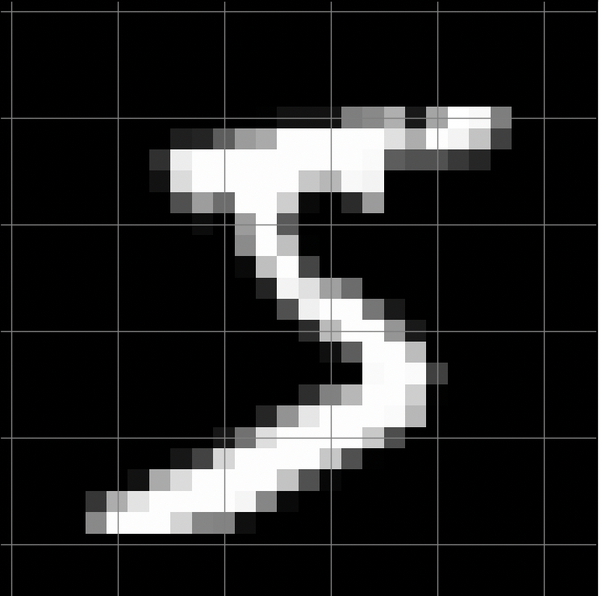
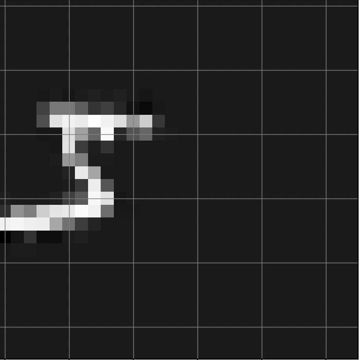
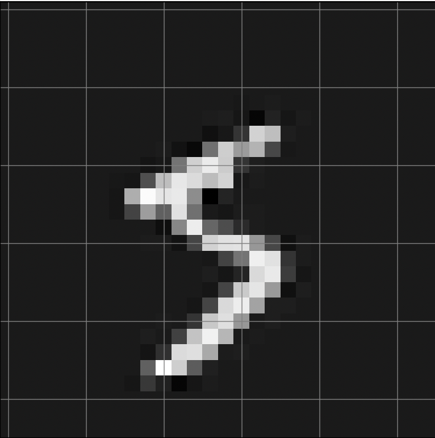
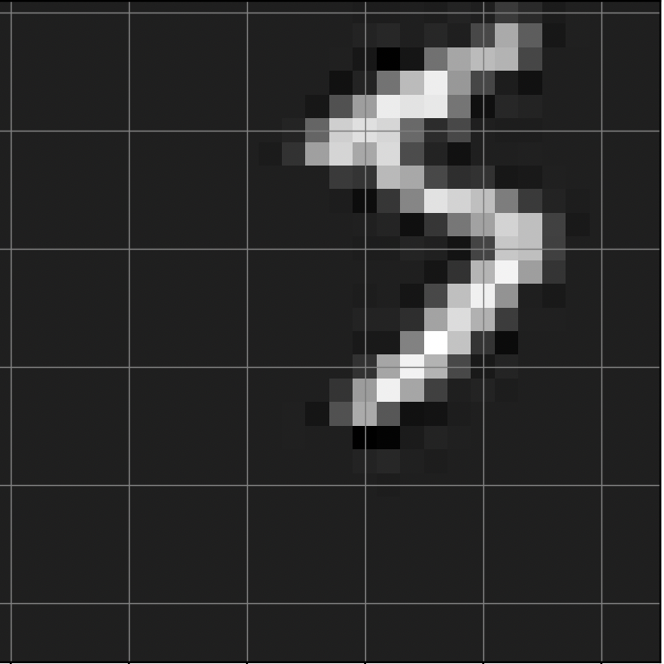

# Neural Network from scratch
I built a multi-layer Neural Network with no machine learning libraries. Try out the model yourself [here](https://number-guesser-efbea.web.app/). See the calculations for the model [here](https://github.com/anshvijay28/NeuralNetwork/blob/main/Neural_Network_Gradient_Computation.pdf).
<br />
<br />
This neural network was designed for multi-class classification on the mnist dataset for determining the value of hand drawn digits. The neural network has 4 layers with an input layer, 2 hidden layers, and an output layer. There are 784 neurons in the input layer, 200 neurons in the first hidden layer, 100 neurons in the second hidden layer, and 10 neurons in the output layer. 
<br />
<br />
The input to the network are images ($28 \times 28$ pixels), which have been flattened to vectors of length 784. Each value within the input vectors are gray scale values (0 - 255) of each pixel, which have been normalized (0 - 1). The output of the network is a vector of length 10 where each value in the vector represents the probability of the image representing digit i, where i is the index of the vector. 
<p align="center">
    
</p>

The activation function at each hidden layer is sigmoid, and the activation function at the output layer is a softmax operation. The softmax function will ensure the output vector is a probability vector. This allows the network to determine the digit by the one with the highest probability.
```
y = np.argmax(output)
```
This network uses stochastic gradient descent for training, which means the weights of the network are updated for each forward and backwards pass. Additionally, an optimal learning rate, a hyperparameter, was found through k fold cross validation. This process helps a network determine hyperparameters by going through a training and testing loops for each potential value of the hyperparameter. During each iteration the training and validation data change. The hyperparameter which yields the most accuracy is chosen. 
<br />
<br />
After iterating through 6 potential learning rates, the best one was found to be `0.0075`. After training the network with this learning rate it yielded an accuracy of `96%`. Once the correct learning rate was determined training was done with 15 epochs. A lower number of epochs resulted in a lower accuracy of 94%. Of course, the number of epochs is another hyperparameter that can be determined through another round of cross validation. Alternately, one could determine the best (learning rate, epoch) pair through nested cross validation. This would mean for each learning rate value you'd train the network with every potential epoch value. 

## Extension: Training Data Interpolation
For the [demo website](https://number-guesser-efbea.web.app/) where users can draw a number, and have this model predict their digit, additional training is needed. This is because most of the data within the original MNIST dataset has the digit at the center of the frame, and on the website the user can draw anywhere. To account for this, for each input image in the training dataset I generated 3 more images each with a randomized set of operations applied to it. The operations I applied to each image are: translation, shrinking, and rotation. The randomness comes from the order in which these operations are applied and the magnitude of each operation (shift, shrink factor, degrees rotated).

```
def interpolate(img: np.ndarray) -> np.ndarray:
    ops = {
        1: rotate_img,
        2: zoom,
        3: translate,
    }
    order = [1, 2, 3]
    np.random.shuffle(order)
    
    img = ops[order[0]](img)
    img = ops[order[1]](img)
    img = ops[order[2]](img)
    
    return img
```
Here is an original input image from the MNIST dataset:
<p align="center">
    
</p>


Here are 3 interpolated images generated from the original used for training: 
<p align="center">
    
    
    
</p>

## Improvements
The model predicting user's digits on the website is far from perfect (the model on the website and the 96% one are not the same). 
- Apply less aggressive translations. The first image is all the way on the edge of the frame. It's unlikely that a user will draw that far off from the center.
- Increase intensity of pixel values. By inspection one can see the interpolated images are duller than the original.
- Get more accurate training data. The MNIST dataset I used in this project was collected from real hand writing. People tend to write differently when tracing on their trackpad/mouse.